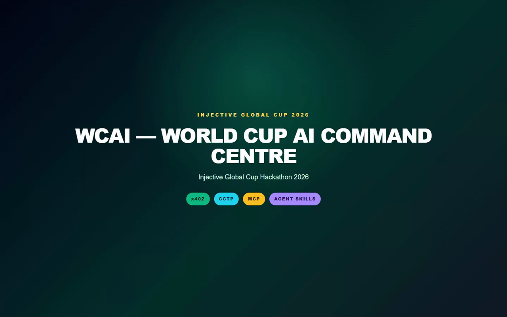
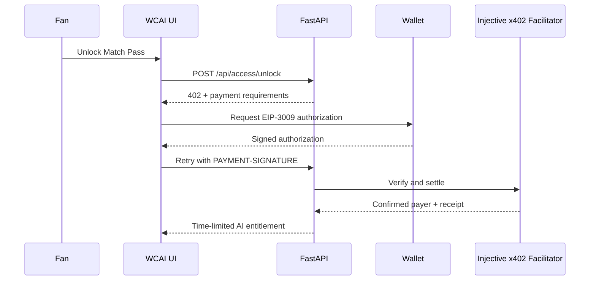
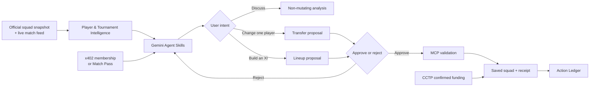
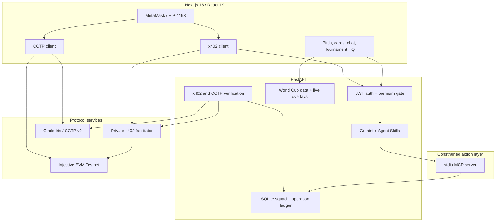

# WCAI — World Cup AI Command Centre

<div align="center">

**Explainable AI squad decisions for World Cup fans, with Injective-backed testnet rails and auditable actions.**

[](https://www.hackquest.io/hackathons/The-Injective-Global-Cup)


[Watch the narrated demo](demo-video/WCAI-Hackathon-Demo.mp4) · [Run locally](#run-locally) · [Explore the architecture](#architecture) · [Read the security model](SECURITY.md)

</div>

<a href="demo-video/WCAI-Hackathon-Demo.mp4">
  
</a>

> **Hackathon demo:** click the image above to watch the complete **10:24 English-narrated product tour**. It begins with a newly created locked account, shows the explicit 30-minute `0 USDC` Hackathon Demo Pro / Match Pass checkout, live entitlement countdown and Ledger receipt, then shows a Gemini lineup proposal followed by the manager pressing **Apply Lineup**, plus a one-player replacement proposal followed by **Confirm Change** and the visible MCP transfer result. It also covers the interactive pitch, player intelligence, Matchday Brief, Tactical Lab, x402 testnet access, CCTP funding, Tournament HQ and the Action Ledger.

## The problem

World Cup fans make fantasy and tactical decisions across disconnected match feeds, squad lists, statistics, AI chats and payment products. That creates three practical failures:

1. **The data is difficult to trust.** Official facts, live events and model estimates are often presented as if they were the same thing.
2. **AI advice is difficult to act on safely.** A chat response may mention one eleven while the UI applies another, change the wrong player or ignore the selected formation.
3. **Premium AI has no transparent action trail.** Fans cannot easily see why access was granted, what was approved or whether an on-chain action actually settled.

## The WCAI solution

WCAI turns a football question into a transparent, budget-valid and user-approved squad decision:

```text
Ask → Analyse → Review exact proposal → Approve or reject → Validate through MCP → Audit the receipt
```

The AI can discuss a matchup without touching the squad, recommend a single replacement without rebuilding the entire eleven, or generate an exact formation-aware lineup when the user explicitly requests one. No AI-generated mutation is persisted until the manager confirms it.

### What a manager can do

- Explore **48 World Cup team pools and 1,248 source-linked players** from the dated FIFA squad snapshot.
- Build an eleven on an interactive pitch using **4-3-3, 4-4-2, 4-2-3-1, 3-5-2 or 5-3-2**.
- Inspect national-team player cards with shirt number, club, roster provenance, availability and clearly separated official facts versus WCAI estimates.
- Ask Gemini for conversational match analysis, position rankings, player reports, one-player replacements or a complete lineup.
- Approve or reject tactical proposals; lineup and transfer mutations are never silently applied.
- Compare formations in the non-mutating **Tactical Lab** and open a source-aware **Matchday Brief**.
- Follow live competition context through **Tournament HQ**, fixtures, knockout routes and squad intelligence.
- Start locked, then explicitly activate a renewable 30-minute **Hackathon Demo Pro** or **Hackathon Match Pass** with a visible `0 USDC` receipt; optionally use the separate wallet-signed **x402** testnet route.
- Add a one-time fantasy budget rail through **Circle CCTP v2 on testnet**.
- Audit access, funding, lineup and transfer activity in a replay-safe **Action Ledger**.

## Why this is useful

| Fan need | WCAI response |
| --- | --- |
| “Who is more likely to win this matchup?” | Conversational analysis first; no unwanted lineup proposal. |
| “Who can replace this one player?” | A constrained, same-role transfer proposal instead of a full squad reset. |
| “Build a 3-5-2 with Messi and Yamal.” | Exact formation, required-player and budget validation before an approval card appears. |
| “Which information is official?” | Source-backed roster facts and live overlays are visibly separated from WCAI estimates. |
| “What did the AI actually change?” | MCP receipt plus a durable, idempotent Action Ledger entry. |
| “How do I access premium analysis?” | A transparent 30-minute judge demo path plus an HTTP-native, wallet-signed x402 testnet payment path. |
| “How does cross-chain USDC affect the product?” | Confirmed CCTP burn/attest/mint receipts unlock a one-time fantasy budget boost. |

## Injective technology, used as product infrastructure

WCAI does not add blockchain as a decorative badge. Each technology controls a distinct part of the fan experience.

| Technology | Role inside WCAI | Verifiable implementation |
| --- | --- | --- |
| **x402** | Protects Gemini chat, Deep Tactical Analytics and time-limited Match Pass access using an HTTP `402 Payment Required` challenge and wallet authorization. | [`lib/x402.ts`](lib/x402.ts), [`backend/app/routers/access.py`](backend/app/routers/access.py), [`backend/app/x402.py`](backend/app/x402.py), [`x402-facilitator/server.mjs`](x402-facilitator/server.mjs) |
| **USDC CCTP v2** | Moves 20 test USDC from Sepolia to Injective EVM Testnet through burn → Circle attestation → mint, then unlocks a one-time fantasy budget rail after receipt verification. | [`components/CctpBridgeModal.tsx`](components/CctpBridgeModal.tsx), [`lib/cctp.ts`](lib/cctp.ts), [`backend/app/cctp_flow.py`](backend/app/cctp_flow.py), [`backend/app/routers/cctp.py`](backend/app/routers/cctp.py) |
| **MCP Server** | Converts an explicitly approved lineup or transfer into a constrained football action with catalog, formation, position and budget checks. | [`backend/app/mcp/server.py`](backend/app/mcp/server.py), [`backend/app/mcp/client.py`](backend/app/mcp/client.py) |
| **Agent Skills** | Gives Gemini typed football tools for search, ranking, squad analysis, reports, replacements, budget validation and formation-aware lineup generation. | [`backend/app/agent/skills.py`](backend/app/agent/skills.py), [`backend/app/agent/prompts.py`](backend/app/agent/prompts.py), [`backend/app/agent/gemini_client.py`](backend/app/agent/gemini_client.py) |

### 1. x402: premium AI without an opaque checkout



- Uses the official `@injectivelabs/x402` package and Injective EVM Testnet (`eip155:1439`).
- The API grants access only after facilitator verification **and** settlement succeed.
- Every newly registered account starts locked. A judge must explicitly choose Demo Pro or Demo Match Pass before premium tools open.
- With `X402_ALLOW_SIMULATED_PURCHASES=true`, that checkout creates a renewable 30-minute, explicitly labelled `0 USDC` Hackathon Demo entitlement and a replay-safe simulated receipt. It never masquerades as an on-chain payment.
- The separate real x402 option still fails closed unless the facilitator, receiver and asset are configured and verification plus settlement succeed.

#### Judge Demo checkout (the default review path)

Every reviewer receives the same reproducible experience without being asked to source test USDC:

1. A newly registered account is **locked**; no premium capability is silently enabled.
2. The reviewer opens **WCAI Access** and deliberately selects **Hackathon Demo Pro** or **Hackathon Match Pass**.
3. The API grants only the selected entitlement for `HACKATHON_DEMO_MINUTES` (default: 30), shows a live countdown, and writes an idempotent receipt to **Action Ledger**.
4. The receipt explicitly states `simulated: true`, `0 USDC`, no wallet signature and no on-chain settlement.
5. On expiry, protected tools lock again. The reviewer can activate a new short-lived demo pass and receive a new receipt.

Demo Pro unlocks Gemini, Deep Tactical Analytics, MCP tactical actions and the finance console. Demo Match Pass unlocks Gemini and analytics only. This prevents a misleading “premium already open” reviewer account while keeping the full product journey testable. The wallet-signed Injective EVM Testnet x402 route remains available separately whenever its facilitator is configured.

### 2. CCTP: cross-chain value tied to a real product action

WCAI uses Circle CCTP v2 for a fixed testnet funding journey:

1. The connected wallet approves and burns 20 test USDC on Sepolia.
2. WCAI polls Circle Iris for the signed attestation.
3. The wallet mints the corresponding test USDC on Injective EVM Testnet.
4. FastAPI independently verifies sender, contracts, selectors, domains, amount and successful receipts.
5. Only then is the one-time 20M fantasy budget backing recorded.

The browser wallet signs every transaction. WCAI never receives a seed phrase or private key.

### 3. MCP: consent becomes a constrained action

The standalone stdio MCP server exposes five football tools:

`get_squad` · `get_player_details` · `set_formation` · `apply_transfer` · `apply_lineup`

Gemini produces advice and structured proposals; MCP is the action boundary. The server rejects unknown players, duplicate IDs, invalid position counts, unsupported formations and over-budget elevens. Confirmed actions return structured receipts that are persisted in the Action Ledger.

### 4. Agent Skills: a football agent, not an unrestricted chatbot

Gemini receives typed WCAI skills instead of direct database mutation access:

`search_player` · `rank_position` · `analyze_squad` · `get_player_report` · `suggest_player_replacement` · `suggest_transfer` · `validate_budget` · `suggest_lineup`

The system prompt enforces domain scope, distinguishes conversation from mutation intent and requires structured player IDs for any proposal. Irrelevant prompts are refused, locked prompts never reach Gemini, and unavailable provider calls fall back to safe deterministic behaviour.

## End-to-end fan journey



## World Cup data and honesty model

WCAI is designed to make provenance visible rather than hide uncertainty.

| Data class | Examples | How it is presented |
| --- | --- | --- |
| **Official snapshot facts** | Team, player, role, shirt number, club and final-squad membership | Linked to the FIFA World Cup 2026 squad-list source; snapshot dated **2026-07-15**. |
| **Runtime live overlays** | Fixtures, scores, goals and assists when exposed by the configured event feed | Refreshed at runtime and labelled with source/update time. Unavailable is not converted into an invented zero. |
| **WCAI estimates** | Fantasy price, points, xG, readiness, risk and scout rating | Explicitly labelled as application estimates, never as official FIFA ratings. |

The catalog contains **48 teams × 26 players = 1,248 players**. Import and provenance logic lives in [`scripts/import_official_fifa_squads.py`](scripts/import_official_fifa_squads.py), with the generated snapshot in [`data/worldcup_2026_rosters.json`](data/worldcup_2026_rosters.json).

## Architecture



### Repository map

| Path | Responsibility |
| --- | --- |
| [`app/`](app) | Next.js routes for INJ Control, Tournament HQ and Manager Ledger. |
| [`components/`](components) | Pitch, player intelligence, chat, Tactical Lab, access and CCTP interfaces. |
| [`lib/`](lib) | Typed API client plus browser-side x402 and CCTP flows. |
| [`backend/app/agent/`](backend/app/agent) | Gemini orchestration, system policy and typed Agent Skills. |
| [`backend/app/mcp/`](backend/app/mcp) | Standalone MCP server and client transport. |
| [`backend/app/routers/`](backend/app/routers) | Authenticated API boundaries for squads, access, CCTP and operations. |
| [`x402-facilitator/`](x402-facilitator) | Private Injective x402 verify/settle sidecar. |
| [`data/`](data) | Source-labelled World Cup roster and match snapshots. |
| [`backend/tests/`](backend/tests) | Regression coverage for access, agent behaviour, formations, receipts and provenance. |
| [`demo-video/`](demo-video) | Narrated hackathon video, thumbnail and reproducible browser automation. |

## Run locally

### Prerequisites

- Node.js 22+
- Python 3.11+
- npm
- MetaMask or another EIP-1193 wallet only for the optional x402/CCTP testnet flows

### 1. Install the frontend

```powershell
git clone https://github.com/kaanklcc/worldcupsquad.git
cd worldcupsquad
npm install

@"
NEXT_PUBLIC_API_URL=http://localhost:8000
"@ | Set-Content .env.local
```

### 2. Configure and run the API

```powershell
cd backend
python -m venv venv
.\venv\Scripts\Activate.ps1
python -m pip install -r requirements.txt
Copy-Item .env.example .env
```

Set only the operator-owned values in `backend/.env`:

```env
GEMINI_API_KEY=
JWT_SECRET_KEY=
AUTH_COOKIE_SECURE=false
X402_FACILITATOR_URL=
X402_PAY_TO=
CORS_ORIGINS=http://localhost:3000
ALLOWED_HOSTS=localhost,127.0.0.1
```

- `GEMINI_API_KEY`: enables the live Gemini provider; safe fallback behaviour remains available without it.
- `JWT_SECRET_KEY`: generate a unique random secret of at least 32 characters.
- `AUTH_COOKIE_SECURE`: keep `false` only for local HTTP; set `true` on the public HTTPS deployment.
- If the frontend and API are on different sites, also set `AUTH_COOKIE_SAMESITE=none`; keep `lax` when they share the same site/domain.
- `X402_PAY_TO`: a **public Injective EVM Testnet receiver address**, never a private key.
- `X402_FACILITATOR_URL`: optional until running the real x402 testnet path below.
- WCAI does not define an `INJECTIVE_MNEMONIC` setting and never accepts a user's seed phrase or private key.
- Before deployment, replace `CORS_ORIGINS` and `ALLOWED_HOSTS` with the exact public frontend origin and API hostname. Set `DOCS_ENABLED=false` unless judges need the schema browser.

Start the API:

```powershell
python -m uvicorn app.main:app --host 127.0.0.1 --port 8000
```

API health: [`http://localhost:8000/health`](http://localhost:8000/health)<br />
OpenAPI: [`http://localhost:8000/docs`](http://localhost:8000/docs)

### 3. Run the UI

In another terminal, from the repository root:

```powershell
npm run dev
```

Open [`http://localhost:3000`](http://localhost:3000).

### Public MVP deployment on Render

The repository includes [`render.yaml`](render.yaml) for two free Render Web Services: the FastAPI API and the Next.js frontend. Import the Blueprint in Render, choose the **Free** instance type for both services, then set these values in the Render dashboard (never commit them):

```env
# API service
GEMINI_API_KEY=
JWT_SECRET_KEY=
APP_ENV=production
AUTH_COOKIE_SECURE=true
AUTH_COOKIE_SAMESITE=lax
DOCS_ENABLED=false
X402_DEMO_MODE=true
X402_ALLOW_SIMULATED_PURCHASES=true
HACKATHON_DEMO_MINUTES=30
X402_NETWORK=eip155:1439
X402_PAY_TO=0xF64aF685CA17369bBC9A41e4E172EfD37A678EC9
X402_RESOURCE_BASE_URL=https://YOUR_API.onrender.com
CORS_ORIGINS=https://YOUR_FRONTEND.onrender.com
ALLOWED_HOSTS=YOUR_API.onrender.com

# Frontend service
NEXT_PUBLIC_API_URL=https://YOUR_API.onrender.com
```

After both services deploy, update the API service's `CORS_ORIGINS` with the exact frontend URL and redeploy it. Use the frontend `https://...onrender.com` URL as the HackQuest MVP link. Free Render web services sleep after 15 minutes without traffic and use ephemeral local storage, so reviewers should create a new account and may need to wait briefly for the first request after idle time.

### 4. Access checkout: judge demo and optional real x402

For submission review, keep `X402_ALLOW_SIMULATED_PURCHASES=true` and `HACKATHON_DEMO_MINUTES=30`. A new account remains locked until the judge opens the access console and activates Demo Pro or Match Pass. The resulting receipt says `simulated: true`, charges `0 USDC`, expires automatically and can be activated again after expiry.

To additionally exercise an actual wallet-signed x402 flow on Injective EVM Testnet:

```powershell
Copy-Item x402-facilitator/.env.example x402-facilitator/.env
# Add a fresh, low-balance, testnet-only facilitator burner key and receiver.
npm run facilitator
```

Then configure the matching `X402_FACILITATOR_URL`, `X402_PAY_TO`, asset and network in `backend/.env`. The real testnet option remains separate in the access console. Full isolation and health-check instructions are in [`x402-facilitator/README.md`](x402-facilitator/README.md).

### 5. Optional: run the CCTP testnet journey

1. Connect the same EVM address that is saved in the WCAI access console.
2. Obtain Sepolia test ETH, Sepolia test USDC and Injective EVM Testnet gas.
3. Select **Acquire 20 USDC backing**.
4. Review each wallet request: approve, burn and destination mint.
5. Wait for the Circle attestation and WCAI receipt verification.

This repository is intentionally testnet-only. Do not configure mainnet assets, RPCs or personal-wallet private keys.

## Judge walkthrough

The full journey is demonstrated in [`demo-video/WCAI-Hackathon-Demo.mp4`](demo-video/WCAI-Hackathon-Demo.mp4). For a fast hands-on review:

1. Register a new account. Confirm that AI and analytics begin locked.
2. Open **WCAI Access** and choose **Hackathon Demo Pro**. Confirm the `0 USDC`, `simulated` checkout disclosure and 30-minute countdown.
3. Open **Action Ledger** and inspect the new replay-safe Demo receipt.
4. Select **3-5-2**, add/remove a player and open a Player Intel card.
5. Ask: `Analyse Argentina versus England, but do not change my lineup.`
6. Ask: `Replace Cubarsí with an attacking Spanish defender.` Review and reject or approve the single-player proposal.
7. Ask: `Build a budget-valid 3-5-2 with Messi and Yamal.` Confirm that the proposal contains the requested formation and exact players.
8. Apply the lineup and inspect its MCP receipt in **Action Ledger**.
9. Open **Deep Tactical Analytics**, **Matchday**, **Tactical Lab** and **Tournament HQ**.
10. Open **Finance** to inspect the separate wallet-signed x402 and CCTP testnet sequence. Use only testnet wallets and test tokens.

## Quality and verification

```powershell
# Frontend
npm run lint
npm run build

# Backend
cd backend
.\venv\Scripts\python.exe -m pip install -r requirements-dev.txt
.\venv\Scripts\python.exe -m pytest -q
.\venv\Scripts\python.exe -m pip_audit --local
.\venv\Scripts\python.exe -m bandit -r app -q
.\venv\Scripts\python.exe -m compileall -q app
```

The backend currently includes **28 regression scenarios** covering:

- premium gating without leaking locked prompts to Gemini;
- locked → Demo Pro / Match Pass → expiry → renewable activation for a newly created account;
- visible `0 USDC` simulated demo receipts, entitlement separation and replay-safe operation receipts;
- x402 v2 challenge construction plus verified facilitator settlement for a non-demo account;
- HttpOnly browser sessions, CSRF enforcement, JWT revocation, one-time high-entropy recovery codes and request-size limits;
- cross-account x402 settlement replay prevention;
- exact formation and required-player persistence;
- conversational analysis versus mutation intent;
- single-player replacement behaviour;
- MCP lineup and transfer validation;
- CCTP wallet matching and one-time funding invariants;
- roster provenance and live-stat labelling;
- Tactical Lab access and operation-ledger idempotency.

## Security boundaries

- All payment and bridge flows are restricted to **Injective EVM Testnet (`eip155:1439`) and Sepolia**.
- No seed phrase, user private key or facilitator key belongs in the FastAPI environment.
- Browser sessions use HttpOnly cookies, double-submit CSRF validation, expiry-aware JWTs and server-side token-version revocation. Passwords use versioned PBKDF2-HMAC-SHA256 with 600,000 iterations.
- Wallet signatures happen in MetaMask; the backend receives only public addresses, authorizations and transaction receipts.
- The x402 facilitator is a separate private service and should use a disposable, low-balance testnet burner key.
- The API verifies x402 settlement before access, consumes each settlement once, links each CCTP mint to the exact attested burn and prevents chain-receipt reuse across accounts.
- Squad, transfer, access and funding operations use idempotency keys to prevent accidental replay.
- Authentication, Gemini, checkout, tactical and live-refresh routes are rate-limited; request bodies and identifiers have explicit bounds.
- Frontend and API responses include CSP, clickjacking, MIME-sniffing, referrer and permissions-policy protections.
- `.env`, SQLite, logs and local build output are ignored by Git.

See [`SECURITY.md`](SECURITY.md) for the complete operator checklist and disclosure guidance.

## Hackathon judging fit

| Injective Global Cup criterion | WCAI evidence |
| --- | --- |
| **Usefulness and clarity** | Solves a concrete fan problem: turning fragmented World Cup intelligence into an explainable squad decision. |
| **Quality of execution** | Typed frontend/backend boundary, exact proposal cards, explicit consent, expiry-aware receipt ledger and 28 regression scenarios. |
| **Simplicity and usability** | One command-centre UI from question to approved action; a new reviewer can unlock a clearly labelled 30-minute demo without wallet friction. |
| **Code structure and documentation** | Separated Next.js UI, FastAPI domain API, Agent Skills, stdio MCP server and private x402 facilitator. |
| **World Cup data integration** | 48 teams, 1,248 sourced players, runtime fixture/event overlays, Matchday Brief and Tournament HQ. |
| **New Injective technologies** | x402 has a browser-signed Injective EVM Testnet verify/settle path; CCTP funds the fantasy rail; MCP validates approved actions; Agent Skills constrain Gemini. The no-charge judge path is separately labelled as a simulation. |
| **Future contribution potential** | Additional live-data adapters, public MCP clients, new paid analytics skills and mainnet migration can be added behind existing boundaries. |

## Submission package

For the Injective Global Cup Typeform submission, provide:

- **Project name:** WCAI — World Cup AI Command Centre
- **Repository:** this GitHub repository, including this README and the testnet-only configuration guidance
- **Demo / product link:** the deployed WCAI URL
- **Demo video:** [`demo-video/WCAI-Hackathon-Demo.mp4`](demo-video/WCAI-Hackathon-Demo.mp4)

For the X post, include a product screenshot or short demo, the repository and product links, tag `@injective`, `@NinjaLabsHQ` and `@NinjaLabsCN`, and use `#InjectiveGlobalCupHackathon`. Mention all four integrations—x402, USDC CCTP, MCP Server and Agent Skills—and add live-data screenshots in the main post’s comments where possible.

## Responsible demo status

WCAI is a hackathon prototype, not a betting, custody or financial-advice product. Fantasy prices and tactical ratings are application estimates. The included blockchain journey uses test tokens with no monetary value. The renewable 30-minute judge path is explicitly marked as simulated and `0 USDC`; provider-confirmed testnet receipts are labelled separately.

## Official references

- [Injective Global Cup hackathon](https://www.hackquest.io/hackathons/The-Injective-Global-Cup)
- [Injective x402 documentation](https://docs.injective.network/developers-ai/x402)
- [Injective USDC + CCTP tutorial](https://docs.injective.network/developers-defi/usdc-cctp-tutorial)
- [Injective EVM network information](https://docs.injective.network/developers-evm/network-information)
- [Circle CCTP documentation](https://developers.circle.com/cctp)
- [FIFA World Cup 2026 teams](https://www.fifa.com/en/tournaments/mens/worldcup/canadamexicousa2026/teams)
- [FIFA World Cup 2026 squad-list source](https://fdp.fifa.org/assetspublic/ce281/pdf/SquadLists-English.pdf)

## License

Released under the [`MIT License`](LICENSE).

---

<div align="center">

**Built for the Injective Global Cup 2026**<br />
x402 · USDC CCTP · MCP Server · Agent Skills

</div>
